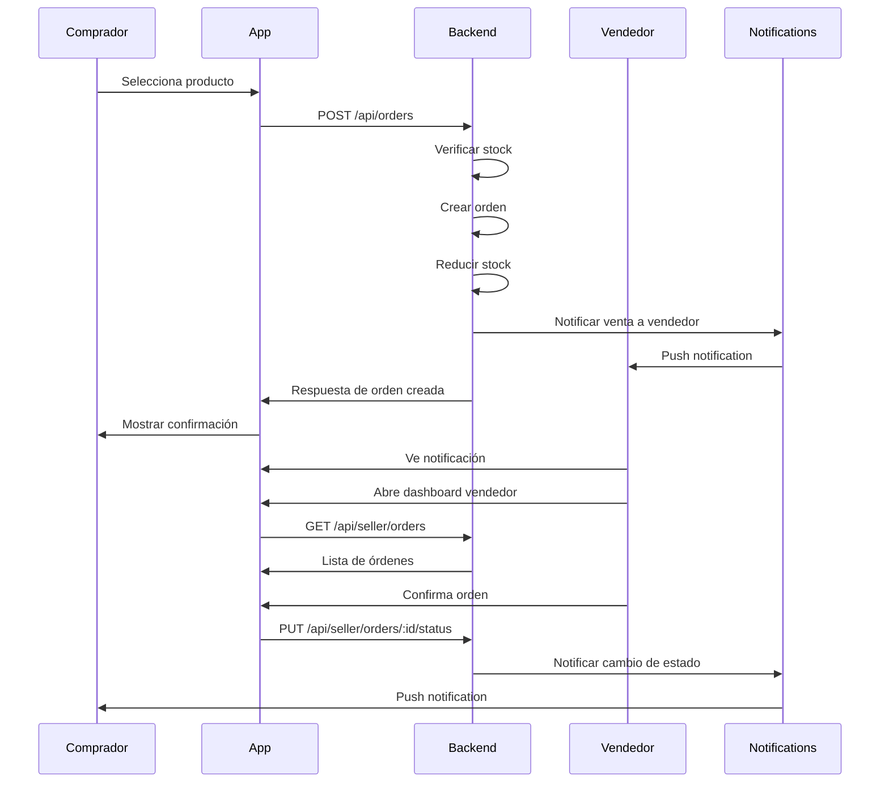

# Plan de Integración: Sistema de Ventas Internas

## 🎯 Objetivo
Implementar un sistema completo de notificaciones para ventas internas con vistas separadas para vendedores y compradores, incluyendo gestión automática de stock.

## 📊 Análisis del Sistema Actual

### ✅ Componentes Existentes
- **Base de Datos**: PostgreSQL con Prisma ORM
- **Productos**: Sistema completo con stock, categorías, imágenes
- **Órdenes**: Creación básica con reducción automática de stock
- **Usuarios**: Autenticación y perfiles completos
- **API**: Express.js con rutas RESTful

### 🔧 Mejoras Necesarias
1. **Sistema de Notificaciones**
2. **Vistas Especializadas por Rol**
3. **Dashboard de Vendedor**
4. **Historial de Comprador**
5. **Gestión Avanzada de Stock**

## 🏗️ Arquitectura Propuesta

```
┌─────────────────┐    ┌─────────────────┐    ┌─────────────────┐
│   Mobile App    │    │   Web App       │    │   Backend API   │
│                 │    │                 │    │                 │
│ ┌─────────────┐ │    │ ┌─────────────┐ │    │ ┌─────────────┐ │
│ │ Vendedor    │ │    │ │ Vendedor    │ │    │ │ Notifications│ │
│ │ Dashboard   │ │    │ │ Dashboard   │ │    │ │ Service      │ │
│ └─────────────┘ │    │ └─────────────┘ │    │ └─────────────┘ │
│                 │    │                 │    │                 │
│ ┌─────────────┐ │    │ ┌─────────────┐ │    │ ┌─────────────┐ │
│ │ Comprador   │ │    │ │ Comprador   │ │    │ │ Stock       │ │
│ │ Dashboard   │ │    │ │ Dashboard   │ │    │ │ Management  │ │
│ └─────────────┘ │    │ └─────────────┘ │    │ └─────────────┘ │
└─────────────────┘    └─────────────────┘    └─────────────────┘
         │                       │                       │
         └───────────────────────┼───────────────────────┘
                                 │
                    ┌─────────────────┐
                    │   Database      │
                    │   PostgreSQL    │
                    │   + Prisma      │
                    └─────────────────┘
```

## 📱 Casos de Uso Detallados

### 👨‍💼 Para Vendedores

#### 1. **Dashboard de Vendedor**
- **Vista Principal**: Estadísticas generales
  - Total de ventas del día/mes
  - Productos con stock bajo
  - Órdenes pendientes
  - Ingresos generados

- **Gestión de Productos**
  - Lista de productos con stock
  - Actualización rápida de stock
  - Productos más vendidos
  - Productos sin stock

- **Gestión de Órdenes**
  - Órdenes pendientes de confirmación
  - Historial de ventas
  - Filtros por estado y fecha
  - Acciones rápidas (confirmar, cancelar)

#### 2. **Sistema de Notificaciones**
- **Notificaciones Push**
  - Nueva orden recibida
  - Stock bajo en producto
  - Orden cancelada por comprador
  - Pago confirmado

- **Notificaciones In-App**
  - Badge de contador en iconos
  - Lista de notificaciones
  - Estados de notificaciones (leída/no leída)

### 👤 Para Compradores

#### 1. **Dashboard de Comprador**
- **Historial de Compras**
  - Órdenes realizadas
  - Estado actual de cada orden
  - Fecha de compra y entrega
  - Información del vendedor

- **Seguimiento de Pedidos**
  - Timeline de estados
  - Información de contacto
  - Opción de cancelar (si aplica)

#### 2. **Notificaciones de Compra**
- **Notificaciones Push**
  - Orden confirmada por vendedor
  - Producto enviado
  - Producto entregado
  - Orden cancelada

## 🔧 Implementación Técnica

### 1. **Base de Datos - Nuevas Tablas**

```sql
-- Tabla de Notificaciones
CREATE TABLE notifications (
  id STRING PRIMARY KEY,
  userId STRING NOT NULL,
  type STRING NOT NULL, -- 'ORDER_CREATED', 'STOCK_LOW', 'ORDER_CONFIRMED', etc.
  title STRING NOT NULL,
  message STRING NOT NULL,
  data JSON, -- Datos adicionales específicos del tipo
  isRead BOOLEAN DEFAULT FALSE,
  createdAt DATETIME DEFAULT NOW()
);

-- Tabla de Configuraciones de Usuario
CREATE TABLE user_settings (
  id STRING PRIMARY KEY,
  userId STRING UNIQUE NOT NULL,
  notificationsEnabled BOOLEAN DEFAULT TRUE,
  stockAlertsEnabled BOOLEAN DEFAULT TRUE,
  orderAlertsEnabled BOOLEAN DEFAULT TRUE,
  createdAt DATETIME DEFAULT NOW(),
  updatedAt DATETIME DEFAULT NOW()
);

-- Tabla de Estadísticas de Vendedor
CREATE TABLE seller_stats (
  id STRING PRIMARY KEY,
  userId STRING UNIQUE NOT NULL,
  totalSales INTEGER DEFAULT 0,
  totalRevenue DECIMAL(10,2) DEFAULT 0,
  productsSold INTEGER DEFAULT 0,
  lastUpdated DATETIME DEFAULT NOW()
);
```

### 2. **API Endpoints Nuevos**

#### **Notificaciones**
- `GET /api/notifications` - Obtener notificaciones del usuario
- `PUT /api/notifications/:id/read` - Marcar como leída
- `PUT /api/notifications/read-all` - Marcar todas como leídas

#### **Dashboard Vendedor**
- `GET /api/seller/dashboard` - Estadísticas del vendedor
- `GET /api/seller/orders` - Órdenes del vendedor
- `GET /api/seller/products` - Productos del vendedor con stock
- `PUT /api/seller/orders/:id/status` - Actualizar estado de orden

#### **Dashboard Comprador**
- `GET /api/buyer/orders` - Órdenes del comprador
- `GET /api/buyer/order/:id/tracking` - Seguimiento de orden

### 3. **Sistema de Notificaciones**

#### **Servicio de Notificaciones**
```javascript
class NotificationService {
  // Crear notificación
  async createNotification(userId, type, title, message, data = {})
  
  // Enviar notificación push
  async sendPushNotification(userId, notification)
  
  // Notificar venta a vendedor
  async notifySaleToSeller(sellerId, orderId, productId)
  
  // Notificar stock bajo
  async notifyLowStock(sellerId, productId, currentStock)
  
  // Notificar cambio de estado de orden
  async notifyOrderStatusChange(buyerId, orderId, newStatus)
}
```

### 4. **Gestión de Stock Mejorada**

#### **Servicio de Stock**
```javascript
class StockService {
  // Verificar stock antes de venta
  async checkStock(productId, quantity)
  
  // Reducir stock
  async reduceStock(productId, quantity)
  
  // Restaurar stock (en caso de cancelación)
  async restoreStock(productId, quantity)
  
  // Verificar productos con stock bajo
  async checkLowStockProducts(sellerId, threshold = 5)
  
  // Actualizar stock manualmente
  async updateStock(productId, newStock)
}
```

## 📱 Pantallas Móviles Propuestas

### **Vendedor**
1. **SellerDashboardScreen** - Vista principal con estadísticas
2. **SellerOrdersScreen** - Gestión de órdenes
3. **SellerProductsScreen** - Gestión de productos y stock
4. **SellerNotificationsScreen** - Centro de notificaciones
5. **SellerStatsScreen** - Estadísticas detalladas

### **Comprador**
1. **BuyerOrdersScreen** - Historial de compras
2. **OrderTrackingScreen** - Seguimiento de orden específica
3. **BuyerNotificationsScreen** - Notificaciones de compras

## 🚀 Plan de Implementación

### **Fase 1: Base de Datos y API (1-2 semanas)**
1. Actualizar esquema de Prisma
2. Crear migraciones
3. Implementar servicios de notificaciones y stock
4. Crear endpoints de API

### **Fase 2: Backend Services (1 semana)**
1. Servicio de notificaciones
2. Servicio de gestión de stock
3. Servicio de estadísticas
4. Integración con sistema de órdenes existente

### **Fase 3: Pantallas Móviles (2-3 semanas)**
1. Dashboard de vendedor
2. Dashboard de comprador
3. Pantallas de notificaciones
4. Pantallas de gestión de stock

### **Fase 4: Notificaciones Push (1 semana)**
1. Configurar servicio de notificaciones push
2. Integrar con Firebase/Expo Notifications
3. Implementar en pantallas móviles

### **Fase 5: Testing y Optimización (1 semana)**
1. Pruebas de integración
2. Optimización de rendimiento
3. Pruebas de notificaciones
4. Ajustes de UX

## 🔄 Flujo de Venta Interna



## 📊 Métricas de Éxito

1. **Para Vendedores**
   - Tiempo promedio de respuesta a órdenes
   - Reducción de stock no actualizado
   - Aumento en ventas por mejor gestión

2. **Para Compradores**
   - Satisfacción con seguimiento de pedidos
   - Tiempo de respuesta de vendedores
   - Reducción de consultas de estado

3. **Para la Plataforma**
   - Aumento en conversión de ventas
   - Reducción de soporte manual
   - Mejora en experiencia de usuario

## 🔐 Consideraciones de Seguridad

1. **Autenticación y Autorización**
   - Verificar que solo vendedores vean sus órdenes
   - Verificar que solo compradores vean sus compras
   - Validar permisos en cada endpoint

2. **Notificaciones**
   - No exponer información sensible en notificaciones
   - Validar que las notificaciones lleguen al usuario correcto

3. **Stock Management**
   - Prevenir condiciones de carrera en actualizaciones de stock
   - Validar stock antes de cada operación
   - Log de todas las operaciones de stock

## 🎨 Consideraciones de UX/UI

1. **Dashboard Vendedor**
   - Información clave visible de inmediato
   - Acciones rápidas (confirmar, actualizar stock)
   - Indicadores visuales de urgencia

2. **Dashboard Comprador**
   - Timeline clara de estados de orden
   - Información de contacto fácil acceso
   - Estados visuales intuitivos

3. **Notificaciones**
   - Agrupación por tipo
   - Acciones rápidas desde notificaciones
   - Badge counters actualizados

Este plan proporciona una base sólida para implementar un sistema completo de ventas internas con notificaciones y vistas especializadas para cada tipo de usuario.
